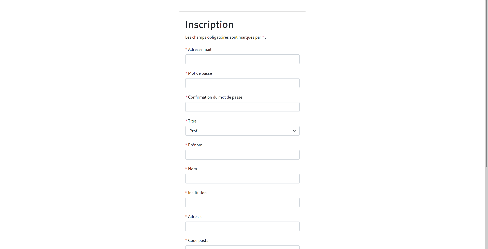
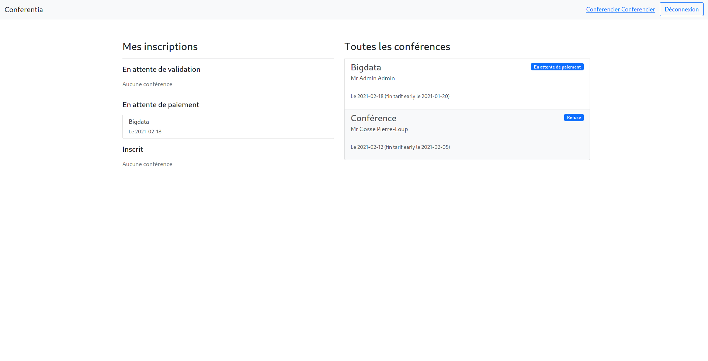
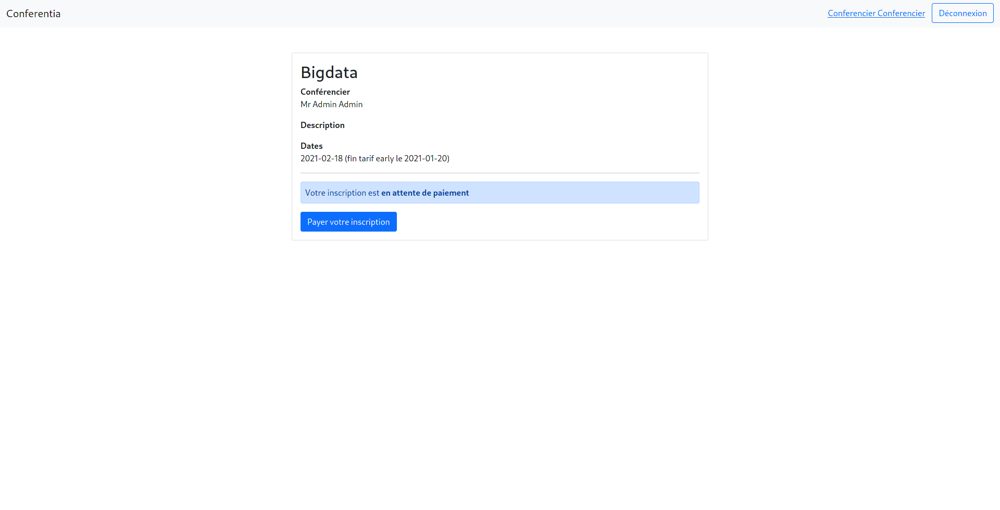
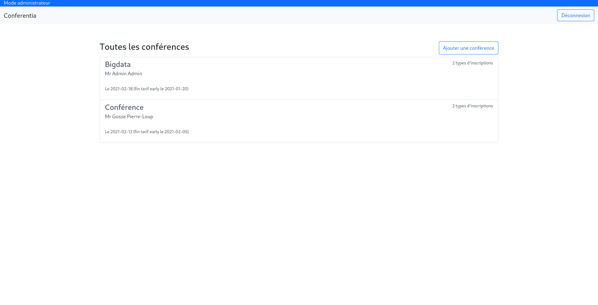
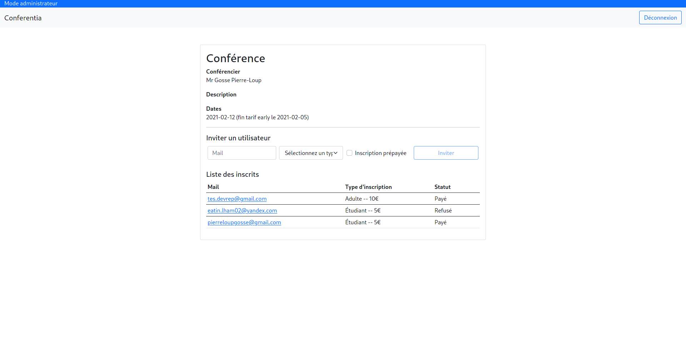

## CONFERENTIA

Conferentia is a web app for managing subscriptions in differents conferences.

## Live demo

http://salimnedjam.live/

## Installation and Setup Instructions

Clone down this repository:

`git clone git@github.com:SalimNedjam/ProjectDevRep.git`

### Client

You will need `node` and `npm` installed globally on your machine.

Installation:

`cd client`

`npm install`

To Start Server:

`npm start`

To Visit App:

`http://localhost:3000/`

### Server

You will need `tomcat` and `mysql` installed on your machine.

#### Tomcat

Deploy the file `Project_war.war` found in the root of the repository in the page at

`http://localhost:8080/manager/html` at the section `WAR file to deploy`.

#### Mysql

After you installed mysql execute `sudo mysql_secure_installation` and configure the mysql server.

you need now to create an user for the database:

`sudo mysql -u root -p` and then type your password.

In mysql shell type:

`CREATE DATABASE project;`

`CREATE USER 'admin'@'localhost' IDENTIFIED BY 'admin';`

`GRANT ALL PRIVILEGES ON * . * TO 'admin'@'localhost';`

`FLUSH PRIVILEGES;`

`exit`

Execute this command in the terminal to load the DB structure.
Warning: if you use MariaDB instead of Mysql you have to change all `utf8mb4_0900_ai_ci` in Dump.sql with `utf8mb4_general_ci`.
The file `Dump.sql` is found in the root of the repository.

`sudo mysql -u root -p project < Dump.sql`

### Administration

You can now connect in `http://localhost:3000/`.

The admin account is:

User:  `admin@admin.com`

Password: `admin`

## Functionality

#### Account Management

- Account creation
- Admin creation (Backend Only)
- Login
- Password reset
- User information change

#### Conferences Management

* Add conferences
* Subscibe to a conference
* Approve or disapprove a subscription
* Pay subscription's fees
* Invite a user to a conference with or without fees (Create account if it doesn't exists)
* Generate an email for each subscription step
* Generate invoice after the payement
* Upload of supporting documents in case of required document for subscription.

#### Other Functionality

* Store token in cookies to create a session
* React Router for URL rooting
* Redux for state container

## Project Screen Shot(s)

	

	

	

	

	

